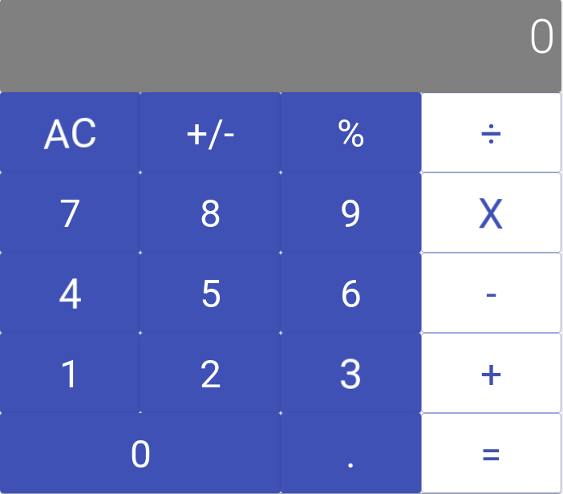

# Project: React Calculator

> This project is about implementing a Calculator using React. You can find more about the requirements [here](https://github.com/microverseinc/project-react-calculator/blob/master/README.md).

## Built With

- Node.js
- React
- React-DOM
- React-Create-App
- Material UI
- React Spring
- npm
- CSS
- ES6

## Live Demo

[Live Demo Link](https://stormy-sands-45425.herokuapp.com/)

## Author

👤 **Johan Stiven Tinjacá Tocora**

- Github: [@jstiven01](https://github.com/jstiven01)
- Twitter: [@TinjacaJohan](https://twitter.com/TinjacaJohan)
- Linkedin: [Johan Tinjacá](https://www.linkedin.com/in/johanstiventinjaca/)